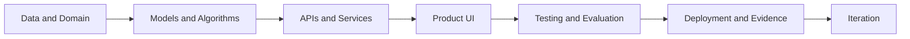

# [Jean Franck Loa Rojas](https://jeanloa.github.io/JeanLoa/)

### Software Engineering Student · AI-Native Builder · Full-Stack Product Systems

I build structured software and applied AI systems—from data and algorithms to APIs, dashboards, testing, documentation, and deployment.

  
  
  

  
  

---

## About Me

I am a Software Engineering student at the Universidad Peruana de Ciencias Aplicadas in Lima, Peru, building toward **AI Engineering and Machine Learning Engineering with a strong software foundation**.

My work combines:

- Applied AI, machine learning, and algorithmic systems
- Backend architecture, APIs, and relational databases
- Frontend dashboards and complete product workflows
- Clean Architecture, Domain-Driven Design, and modular systems
- Documentation, testing, deployment, and delivery evidence

My goal is to move beyond isolated technical demos and build systems that are structured, measurable, documented, and ready to evolve.

---

## Engineering Workspaces

<table>
  <tr>
    <td width="50%" valign="top">
      <h3>
        <a href="https://github.com/Path-AI-Engineer">🤖 Path AI Engineer</a>
      </h3>
      

        My long-term AI Engineering workspace for developing strong foundations in machine learning systems and applied AI.
      

      

        <strong>Current focus:</strong> model evaluation, feature engineering, forecasting, data workflows, APIs, MLOps, LLMs, RAG, agents, computer vision, and platform architecture.
      

      

        <strong>Long-term exploration:</strong> robotics, Quantum AI, and Quantum Machine Learning.
      

    </td>
    <td width="50%" valign="top">
      <h3>
        <a href="https://github.com/Path-Software-Engineer">🧱 Path Software Engineer</a>
      </h3>
      

        My software engineering workspace for turning technical depth into complete, usable applications.
      

      

        <strong>Current focus:</strong> frontend, backend, APIs, databases, dashboards, testing, documentation, sprints, Gitflow, deployment, and product-oriented architecture.
      

    </td>
  </tr>
</table>

---

## Featured Projects

<table>
  <tr>
    <td width="33%" valign="top">
      <h3>🚦 SmartLocation</h3>
      
<strong>Route Optimization Platform</strong>

      

        Urban route-planning system built around traffic data, graph algorithms, and geospatial visualization.
      

      

        Worked with a graph dataset containing more than <strong>1,500 nodes</strong> and compared multiple routing strategies.
      

      

        <code>Angular</code>
        <code>Python</code>
        <code>Dijkstra</code>
        <code>A*</code>
        <code>BFS</code>
        <code>Graphs</code>
      

    </td>
    <td width="33%" valign="top">
      <h3>🌊 LowCortisol</h3>
      
<strong>Water & Gas Monitoring Platform</strong>

      

        IoT operations platform for managing sites, device groups, sensors, valves, consumption, alerts, reports, and support workflows.
      

      

        Built as a modular full-stack system with REST APIs, operational dashboards, and deployable services.
      

      

        <code>Vue 3</code>
        <code>C#</code>
        <code>ASP.NET Core</code>
        <code>PostgreSQL</code>
        <code>DDD</code>
        <code>CQRS</code>
      

    </td>
    <td width="33%" valign="top">
      <h3>⚡ ElectroCorp</h3>
      
<strong>Smart Energy Platform</strong>

      

        Enterprise-style platform for subscriptions, spaces, rooms, devices, routines, energy monitoring, billing, alerts, reports, and support.
      

      

        Developed with modular backend architecture, authentication, database persistence, deployment, and Gitflow delivery discipline.
      

      

        <code>Angular</code>
        <code>Java</code>
        <code>Spring Boot</code>
        <code>PostgreSQL</code>
        <code>JWT</code>
        <code>DDD</code>
      

    </td>
  </tr>
</table>

---

## How I Build Systems

I approach AI and software as complete systems. A useful model or algorithm is only one component; it also needs reliable data, clear interfaces, evaluation, documentation, and a product flow that people can use.

---

## Core Stack

  
  
  
  
  
  
  
  
  
  

### Current Technical Direction

- **AI Engineering:** ML systems, evaluation, forecasting, data pipelines, MLOps, LLMs, RAG, agents, and applied AI products.
- **Software Engineering:** backend services, APIs, databases, frontend workflows, testing, deployment, and maintainable architecture.
- **Product Engineering:** connecting technical components into systems that solve complete user and business workflows.

---

## Engineering Principles

> Explore before executing.  
> Execute with a map.  
> Document every advance.  
> Compare before improving.  
> Build to understand.

**I build systems with structure, purpose, evidence, and room to grow.**

---

## Open To

I am interested in international internships and remote opportunities related to:

`AI Engineering` · `Machine Learning Engineering` · `Applied AI` · `Backend Engineering` · `Software Engineering` · `AI Agents` · `RAG` · `ML Systems`
