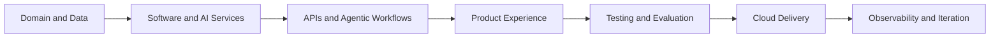

# [Jean Franck Loa Rojas](https://jeanloa.github.io/JeanLoa/)

### Software Engineer · AI Engineer · Agentic Systems Builder

I design and build production-oriented software and AI platforms—from modern web applications and distributed APIs to machine learning pipelines, RAG systems, autonomous agents, and cloud delivery.

  
  
  

  
  

---

## Engineering Profile

I am a Software Engineering student at the Universidad Peruana de Ciencias Aplicadas in Lima, Peru, with a project portfolio spanning **full-stack product engineering, applied AI, agentic systems, cloud platforms, and enterprise architecture**.

I build complete systems across:

- **AI & Agentic Engineering:** machine learning, computer vision, LLMs, RAG, tool use, workflow agents, evaluation, guardrails, and MLOps.
- **Full-Stack Engineering:** Next.js, Angular, Vue, NestJS, Spring Boot, ASP.NET Core, FastAPI, relational databases, and end-to-end product workflows.
- **Cloud & Platform Engineering:** AWS, Microsoft Azure, Google Cloud Platform, Docker, CI/CD, observability, deployment, and operational evidence.
- **Software Architecture:** Domain-Driven Design, Clean Architecture, CQRS, modular monoliths, microservices, event-driven systems, testing, and documentation.

My work connects domain logic, data, intelligence, APIs, user experience, and infrastructure into systems that are measurable, maintainable, and ready to evolve.

---

## Engineering Workspaces

<table>
  <tr>
    <td width="50%" valign="top">
      <h3>
        <a href="https://github.com/Path-AI-Engineer">AI Engineer Path</a>
      </h3>
      

        An end-to-end AI Engineering portfolio covering predictive systems, forecasting, classification, segmentation, optimization, computer vision, model delivery, LLM applications, RAG, agents, evaluation, and AI platform architecture.
      

      

        <strong>Delivered through:</strong> reproducible experiments, APIs, dashboards, model evidence, technical demos, deployment workflows, and documented engineering decisions.
      

    </td>
    <td width="50%" valign="top">
      <h3>
        <a href="https://github.com/Path-Software-Engineer">Software Engineer Path</a>
      </h3>
      

        A complete software engineering portfolio spanning frontend systems, backend services, distributed architecture, databases, testing, security, observability, DevOps, cloud infrastructure, and AI-enabled products.
      

      

        <strong>Delivered through:</strong> Next.js and Angular applications, NestJS, Spring Boot and .NET services, modular architecture, Gitflow, CI/CD, deployment, and product-oriented documentation.
      

    </td>
  </tr>
</table>

---

## Featured Systems

<table>
  <tr>
    <td width="33%" valign="top">
      <h3>ElectroCorp</h3>
      
<strong>Smart Energy Platform</strong>

      

        Enterprise platform connecting subscriptions, workplaces, rooms, devices, routines, energy monitoring, billing, alerts, reports, and support workflows.
      

      

        <code>Angular</code>
        <code>Spring Boot</code>
        <code>PostgreSQL</code>
        <code>JWT</code>
        <code>DDD</code>
      

    </td>
    <td width="33%" valign="top">
      <h3>LowCortisol</h3>
      
<strong>Water & Gas Operations Platform</strong>

      

        IoT-oriented product for workplaces, rooms, device groups, sensors, valves, consumption, alerts, goals, reports, and operational control.
      

      

        <code>Vue 3</code>
        <code>ASP.NET Core</code>
        <code>PostgreSQL</code>
        <code>CQRS</code>
        <code>DDD</code>
      

    </td>
    <td width="33%" valign="top">
      <h3>SmartLocation</h3>
      
<strong>Route Optimization Platform</strong>

      

        Geospatial route-planning system combining traffic data, graph modeling, interactive maps, and comparative pathfinding algorithms.
      

      

        <code>Angular</code>
        <code>Python</code>
        <code>MapLibre</code>
        <code>Dijkstra</code>
        <code>A*</code>
      

    </td>
  </tr>
  <tr>
    <td width="33%" valign="top">
      <h3>DecodeLabs AI Projects</h3>
      
<strong>Applied AI Internship Portfolio</strong>

      

        Four inspectable AI products covering deterministic intent routing, leakage-safe classification, content-based recommendations, and confidence-aware OCR.
      

      

        <code>Python</code>
        <code>Streamlit</code>
        <code>scikit-learn</code>
        <code>OpenCV</code>
        <code>Tesseract</code>
      

    </td>
    <td width="33%" valign="top">
      <h3>Agentic AI Platforms</h3>
      
<strong>RAG, Tools & Autonomous Workflows</strong>

      

        Agent-oriented systems combining retrieval, tool calling, workflow orchestration, memory, evaluation signals, guardrails, and observable execution.
      

      

        <code>LangGraph</code>
        <code>RAG</code>
        <code>FastAPI</code>
        <code>Vector Search</code>
        <code>MCP</code>
      

    </td>
    <td width="33%" valign="top">
      <h3>Cloud-Native Products</h3>
      
<strong>Multi-Cloud Delivery</strong>

      

        Deployable applications designed around containerized services, automated delivery, managed data, observability, security, and scalable cloud infrastructure.
      

      

        <code>AWS</code>
        <code>Azure</code>
        <code>GCP</code>
        <code>Docker</code>
        <code>CI/CD</code>
      

    </td>
  </tr>
</table>

---

## Frameworks & Engineering Ecosystem

### Frontend, Product UI & Visualization

  
  
  
  
  
  
  
  
  
  

### Backend, APIs & Distributed Services

  
  
  
  
  
  
  
  
  

### Machine Learning, Deep Learning & MLOps

  
  
  
  
  
  
  
  
  
  
  

### LLMs, RAG & Agentic AI

  
  
  
  
  
  
  
  
  
  

### Computer Vision, Multimodal AI & Edge

  
  
  
  
  
  
  
  

### Data, Streaming, Search & Storage

  
  
  
  
  
  
  
  
  
  
  
  
  

### Cloud AI & Managed Platforms

  
  
  
  
  
  
  
  
  
  
  
  

### DevOps, Infrastructure & Observability

  
  
  
  
  
  
  
  
  

### Testing, Security & Architecture

  
  
  
  
  
  
  
  
  
  
  
  
  
  

### Reinforcement Learning, Quantum AI & Robotics

  
  
  
  
  
  
  
  

---

## How I Build

I treat software and AI as complete engineering systems. Models, agents, APIs, interfaces, databases, infrastructure, evaluation, and documentation are designed as connected parts of the same product.

---

## Engineering Principles

> Understand the domain. 
> Design the boundaries. 
> Build the evidence. 
> Automate the delivery. 
> Measure the outcome.

**I build complete software and AI systems with structure, operational clarity, and product purpose.**

---

## Open To

I am open to international and remote opportunities in:

`Software Engineering` · `AI Engineering` · `Machine Learning Engineering` · `Full-Stack Engineering` · `Backend Engineering` · `Agentic AI` · `Cloud Engineering` · `Applied AI`
